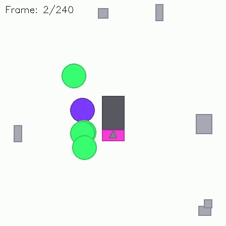

# Handover Action Dataset Generator

A synthetic dataset generator for training action detection models on object handover scenarios between actors. Designed for neuro-symbolic AI research with multi-level ground truth annotations.

<table>
  <tr>
    <td></td>
    <td></td>
  </tr>
</table>

## Overview

This tool generates image sequences simulating a top-down scene where two types of actors (blue and green) perform object handovers. Green actors prepare and transport objects, while blue actors receive, use, and return them. The generator supports both continuous movement and discrete grid-based movement modes, with comprehensive annotations in YOLO format, JSON, and ASCII visualization.

> **Inspiration**: This generator was originally inspired by the problem of detecting instrument handovers in complex surgery scenes, where precise action recognition is critical. The abstracted geometric representation makes it suitable for controlled experiments in action detection and neuro-symbolic reasoning.

## Key Features

- **Dual Movement Modes**: Continuous pixel-based or discrete 16×16 grid movement
- **Multi-Level Annotations**: YOLO bounding boxes, per-frame JSON, ASCII grid visualization
- **Robustness Testing**: Fake handovers, failed handovers, approach-only events
- **Object Randomization**: Random shapes (triangle, square, circle) and colors
- **Reproducible**: Fully deterministic with seed control

## Scene Description

- **Working Area**: Central rectangle where blue actors operate
- **Preparation Area**: Rectangle where objects are prepared by green actors
- **Blue Actors**: Blue circles that receive objects, work with them, and return them
- **Green Actors**: Green circles that prepare and transport objects
- **Objects**: Triangles/squares/circles (optionally randomized) that can be held, used, or transferred
- **Scene Objects**: Gray rectangles of various sizes at the scene edges
- **Occlusion Objects**: Black rectangles that randomly appear to test occlusion robustness

## Action Labels

| Class ID | Label | Description |
|----------|-------|-------------|
| 0 | green_prepares | Green actor at prep area handling objects |
| 1 | blue_works | Blue actor actively using object (spinning) |
| 2 | actor_holds | Any actor holding an object |
| 3 | green_gives | Green actor handing object to blue actor |
| 4 | green_receives | Green actor receiving object from blue actor |
| 5 | handover | Combined box during green↔blue handover |
| 6 | actor | Generic actor bounding box |
| 7 | blue | Blue actor bounding box |
| 8 | green | Green actor bounding box |
| 9 | fake_handover | Same-color handover (green↔green or blue↔blue) |
| 10 | failed_handover | Handover aborted after actors approached |
| 11 | approach_only | Actors approached without object/intent |

## Installation

```bash
pip install -r requirements.txt
```

## Usage

### Basic Usage

```bash
python dataset_generator.py
```

### With Configuration File

```bash
python dataset_generator.py --config config.yaml
```

### Create Default Config

```bash
python dataset_generator.py --create-config
```

### Command-Line Options

```
--config, -c     Path to configuration YAML file
--output, -o     Output directory (default: 'output')
--frames, -f     Number of frames to generate
--seed, -s       Random seed for reproducibility
--create-config  Create a default config file and exit
```

## Configuration Options

### Scene Setup

| Parameter | Default | Description |
|-----------|---------|-------------|
| num_blue_actors | 2 | Total blue actors in scene |
| num_green_actors | 3 | Total green actors in scene |
| num_active_blue | 1 | Blue actors participating in handovers |
| num_active_green | 2 | Green actors participating in handovers |
| num_objects | 5 | Number of objects on prep area |
| num_scene_objects | 8 | Random objects around edges |
| total_num_frames | 1000 | Total frames to generate |
| num_separated_videos | 4 | Separate sequences with new scene setup |
| img_size | 448 | Image dimensions (square) |
| seed | 42 | Random seed for reproducibility |

### Movement Mode

| Parameter | Default | Description |
|-----------|---------|-------------|
| use_grid_movement | false | Use discrete grid movement instead of continuous |
| grid_size | 16 | Grid dimensions (grid_size × grid_size) |
| movement_speed | 3.0 | Movement speed per frame (continuous mode) |

### Action Durations

| Parameter | Default | Description |
|-----------|---------|-------------|
| prepare_duration_avg | 20 | Average frames for preparation |
| work_duration_avg | 25 | Average frames for blue actor work |
| hold_duration_avg | 8 | Average frames holding before action |
| handover_duration | 2 | Exact frames for handover (giver→receiver) |

### Robustness Testing

| Parameter | Default | Description |
|-----------|---------|-------------|
| enable_fake_handovers | false | Enable same-color handovers |
| fake_handover_prob | 0.1 | Probability per frame in HOLDING state |
| handover_success_rate | 1.0 | Probability handover succeeds after approach |
| approach_without_ho_rate | 0.0 | Probability of approach without object |

### Object Randomization

| Parameter | Default | Description |
|-----------|---------|-------------|
| randomize_instruments | false | Randomize object appearance on pickup |
| instrument_colors | [(255,0,0), ...] | List of RGB colors for random selection |
| instrument_shapes | ["triangle", "square", "circle"] | Available shapes |

### Visual Options

| Parameter | Default | Description |
|-----------|---------|-------------|
| visualize_handover | false | Highlight actors during handover |
| occlusion_obj_appearance_prob | 0.01 | Probability of occlusion object appearing |
| occlusion_obj_max_num | 3 | Maximum concurrent occlusion objects |
| occlusion_obj_max_size | 0.5 | Max size as fraction of img_size |
| instrument_hidden_prob | 0.01 | Probability object is invisible |

### Collision Avoidance

| Parameter | Default | Description |
|-----------|---------|-------------|
| allow_handover_overlap | false | Allow multiple simultaneous handovers |
| person_avoidance_radius_multiplier | 4.0 | Start avoiding at radius × this |
| person_separation_buffer | 2.0 | Extra space between actors |

### Export Options

| Parameter | Default | Description |
|-----------|---------|-------------|
| export_json | true | Export per-frame JSON scene descriptions |
| export_ascii | true | Export ASCII grid visualization (grid mode only) |

See `config.yaml` for all available options with comments.

## Output Structure

```
output/
├── images/
│   ├── train/
│   │   ├── frame_000000.jpg
│   │   └── ...
│   └── val/
│       └── ...
├── labels/
│   ├── train/
│   │   ├── frame_000000.txt
│   │   └── ...
│   └── val/
│       └── ...
├── json_frames/
│   ├── frame_000000.json
│   └── ...
├── ascii_frames/          # Only in grid mode
│   ├── frame_000000.txt
│   └── ...
├── classes.txt
├── data.yaml
├── sequence_summary.json
└── config.yaml
```

## Annotation Formats

### YOLO Format (labels/*.txt)

Standard YOLO format with normalized coordinates:
```
class_id x_center y_center width height
```

Example:
```
6 0.523438 0.310547 0.089286 0.089286
7 0.523438 0.310547 0.089286 0.089286
5 0.481641 0.429688 0.187500 0.142578
2 0.523438 0.310547 0.089286 0.089286
```

### JSON Format (json_frames/*.json)

Detailed per-frame data with entity states and relationships:

```json
{
  "frame": 42,
  "grid_mode": true,
  "grid_size": 16,
  "entities": [
    {
      "id": 0,
      "role": "green",
      "state": "GIVING",
      "position": {"x": 224.0, "y": 168.0},
      "grid_position": {"row": 6, "col": 8},
      "is_holding": true,
      "held_object_id": 3,
      "is_instrument_hidden": false,
      "is_in_handover": true,
      "handover_partner_id": 2,
      "is_failed_handover": false,
      "is_approach_only": false
    }
  ],
  "active_handovers": [
    {
      "giver_id": 0,
      "receiver_id": 2,
      "object_id": 3,
      "direction": "green_to_blue",
      "is_fake": false
    }
  ],
  "failed_handovers": [],
  "approach_only_events": [],
  "occlusion_rectangles": []
}
```

### ASCII Format (ascii_frames/*.txt) - Grid Mode Only

Detailed 4×4 sub-grid representation for each cell, showing actors, objects, states, and occlusions:

```
     0   1   2   3   4   5   6   7   
    +--------------------------------
  0 |................................
    |................................
    |................................
    |................................
  1 |....WWWW........................
    |....W..W........................
    |....W..W........................
    |....WWWW........................
  2 |........bbbb....................
    |........b^.b....................
    |........b..b....................
    |........bbbb....................
  3 |....gggg........................
    |....g+.g........................
    |....g..g........................
    |....gggg........................
  4 |PPPP............................
    |P^+P............................
    |P*xP............................
    |PPPP............................
  5 |................................
    |................................
    |................................
    |................................
```

**Legend:**

| Symbol | Description |
|--------|-------------|
| `.` | Empty space |
| `g` | Green actor border |
| `b` | Blue actor border |
| `P` | Preparation area |
| `W` | Working area |
| `O` | Scene object |
| `?` | Occluded area |
| `^`, `+`, `*`, `x`, `o` | Objects (consistent per object ID) |

**Cell Structure (4×4 per grid cell):**

```
gggg     <- Border (g=green, b=blue)
g^.g     <- Inner 2×2 body with object symbol
g..g     
gggg     <- Border
```

**Features:**
- Each grid cell expands to 4×4 characters for detail
- Actors show held objects in their inner body
- Blue actors in WORKING state animate the object rotating through inner positions
- Occlusion rectangles render as solid `?` blocks
- Hidden objects (via `instrument_hidden_prob`) are not rendered even when held
- Object symbols are consistent across frames (same object = same symbol)

### Sequence Summary (sequence_summary.json)

Statistics and metadata for the full sequence:

```json
{
  "total_frames": 1000,
  "config": {
    "num_green_actors": 3,
    "num_blue_actors": 2,
    "num_active_green": 2,
    "num_active_blue": 1,
    "num_objects": 5,
    "grid_mode": true,
    "grid_size": 16,
    "image_size": 448,
    "seed": 42,
    "handover_success_rate": 0.8,
    "approach_without_ho_rate": 0.1,
    "enable_fake_handovers": true,
    "fake_handover_prob": 0.1,
    "randomize_instruments": false,
    "occlusion_obj_appearance_prob": 0.0,
    "instrument_hidden_prob": 0.0
  },
  "statistics": {
    "total_handovers": 45,
    "total_fake_handovers": 3,
    "total_failed_handovers": 12,
    "total_approach_only": 5
  },
  "handover_events": []
}
```

## State Machines

### Green Actor States

```
IDLE → MOVING_TO_PREP → PREPARING → HOLDING
                                       ↓
                        ┌──────────────┴──────────────┐
                        ↓                             ↓
              MOVING_TO_BLUE               (fake handover to
                        ↓                   same-color actor)
                     GIVING
                        ↓
               WAITING_BY_BLUE
                        ↓
                   RECEIVING
                        ↓
              MOVING_FROM_BLUE → PREPARING → ...
```

### Blue Actor States

```
        IDLE
          ↓
      RECEIVING ← (from green)
          ↓
       HOLDING
          ↓
       WORKING
          ↓
       GIVING → (to green)
          ↓
        IDLE
```

## Robustness Testing Features

### Fake Handovers
Same-color actors (green↔green or blue↔blue) perform handovers. Tests if a model correctly identifies valid vs invalid handover pairs.

```yaml
enable_fake_handovers: true
fake_handover_prob: 0.1
```

### Failed Handovers
Actors approach for handover but abort without transferring the object. Tests if a model distinguishes approach from actual handover.

```yaml
handover_success_rate: 0.8  # 20% of handovers will fail
```

### Approach-Only Events
Actors approach each other without carrying an object. Tests if a model relies on proximity alone.

```yaml
approach_without_ho_rate: 0.1
```

## Integration with YOLO

The generated `data.yaml` can be directly used with Ultralytics YOLO:

```python
from ultralytics import YOLO

model = YOLO('yolov8n.pt')
results = model.train(data='output/data.yaml', epochs=100)
```

## Dataset Players

### Image Dataset Player

Visualize generated datasets with optional bounding box overlay.

#### Command-Line Usage

```bash
# Play dataset with bounding boxes
python dataset_player.py output/

# Play validation split
python dataset_player.py output/ --split val

# Play without bounding boxes
python dataset_player.py output/ --no-boxes

# Export to video
python dataset_player.py output/ --export output_video.mp4

# Show statistics
python dataset_player.py output/ --stats

# Adjust playback speed and scale
python dataset_player.py output/ --fps 15 --scale 1.5
```

#### Playback Controls

| Key | Action |
|-----|--------|
| SPACE | Pause/Resume |
| LEFT/RIGHT | Previous/Next frame (when paused) |
| B | Toggle bounding boxes |
| L | Toggle labels |
| +/- | Increase/Decrease speed |
| Q/ESC | Quit |

#### Python API

```python
from dataset_player import DatasetPlayer

# Create player
player = DatasetPlayer('output/', split='train')

# Get statistics
stats = player.get_statistics()
print(stats)

# Get a single frame with annotations
frame = player.get_frame(100, show_boxes=True)
frame.show()

# Play interactively (requires OpenCV)
player.play_cv2(fps=30, show_boxes=True)

# Export to video
player.export_video('output.mp4', fps=30, show_boxes=True)
```

### ASCII Dataset Player

Play ASCII frames directly in the terminal (grid mode only).

#### Command-Line Usage

```bash
# Auto-play at 10 FPS
python ascii_dataset_player.py output/

# Interactive mode (manual frame stepping)
python ascii_dataset_player.py output/ --interactive

# Show single frame
python ascii_dataset_player.py output/ --frame 100

# Custom speed, no loop
python ascii_dataset_player.py output/ --fps 5 --no-loop

# Start from specific frame
python ascii_dataset_player.py output/ --start 50
```

#### Interactive Controls

| Key | Action |
|-----|--------|
| n / → | Next frame |
| p / ← | Previous frame |
| SPACE | Toggle auto-play |
| +/- | Adjust speed |
| q | Quit |

#### Python API

```python
from ascii_dataset_player import AsciiDatasetPlayer

# Create player
player = AsciiDatasetPlayer('output/')

# Show single frame
player.show_frame(100)

# Auto-play
player.play(fps=10, loop=True)

# Interactive mode
player.play_interactive()

# Access frames directly
frame_content = player[50]  # Get frame 50 as string
print(len(player))  # Number of frames
```

## Example Configuration

```yaml
# Scene setup
num_doctors: 2        # blue actors
num_assistants: 3     # green actors
num_active_doctors: 1
num_active_assistants: 2
num_instruments: 5

# Grid mode (recommended for neuro-symbolic research)
use_grid_movement: true
grid_size: 16

# Frame generation
total_num_frames: 1000
num_separated_videos: 4
img_size: 448
seed: 42

# Robustness testing
enable_fake_handovers: true
fake_handover_prob: 0.1
handover_success_rate: 0.8
approach_without_ho_rate: 0.1

# Object randomization
randomize_instruments: true

# Timing
handover_duration: 2
prepare_duration_avg: 20
work_duration_avg: 25

# Export options
export_json: true
export_ascii: true
```

## Reproducibility

The dataset generation is fully deterministic when using the same seed. The complete config is saved in the output directory for reference.

## Architecture

```
├── config.py               # Configuration dataclass
├── dataset_generator.py    # Main entry point
├── process_manager.py      # Scene state management
├── person.py               # Actor state machines
├── instrument.py           # Objects with shape/color
├── scene_object.py         # Areas and scene objects
├── grid_manager.py         # Grid-based positioning
├── pathfinding_utils.py    # A* pathfinding for grid mode
├── render_manager.py       # PIL-based rendering
├── annotation_manager.py   # YOLO label generation
├── exporter.py             # JSON/ASCII export
├── ascii_generator.py      # 4×4 sub-grid ASCII rendering
├── dataset_player.py       # Image playback with annotations
├── ascii_dataset_player.py # Terminal-based ASCII playback
├── enums.py                # State and label enums
└── utils.py                # Helper functions
```

## License

MIT License